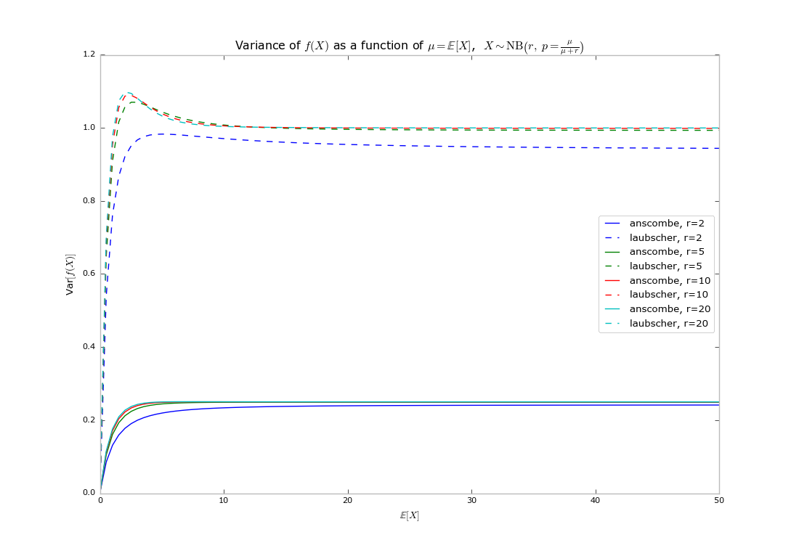

## Installation ##

This should download and install all dependencies and make the `spikestim`
package importable from anywhere:

```
git clone git@github.com:mattjj/spikestim.git
cd spikestim
pip install -e .
```

## Usage ##

The main functions are `fit_maxlike`, `get_posterior_samples`, `make_anscombe_stabilizer`,
and `make_laubscher_stabilizer`.

### Fit negative binomial parameters via maximum likelihood ###

```python
from spikestim import fit_maxlike
r, p = fit_maxlike(data, r_guess=10.)
```

The implementation is in spikestim/negbin_maxlike.py.

Maximum likelihood can have some defects; for example, there is no maximum
likelihood estimator when `np.var(data) > np.mean(data)`. Furthermore, the
fitting functions may run into local optima (and it must be initialized with
`r_guess`).

### Sample negative binomial parameters from Bayesian posterior ###

Alternatively, you can do a Bayesian analysis by collecting MCMC samples from a
posterior over the negative binomial parameters:

```python
from spikestim import get_posterior_samples
samples = get_posterior_samples(data)  # samples is a list [(r1, p1), (r2, p2), ...]
```

The implementation is in spikestim/negbin_bayes.py.

### Variance stabilization ###

See the example files
[stabilizer_test.py](https://github.com/mattjj/spikestim/blob/master/examples/stabilizer_test.py)
and
[stabilizing_data.py](https://github.com/mattjj/spikestim/blob/master/examples/stabilizing_data.py).



### More! ###

Try reading the examples in the [examples
directory](https://github.com/mattjj/spikestim/tree/master/examples).
